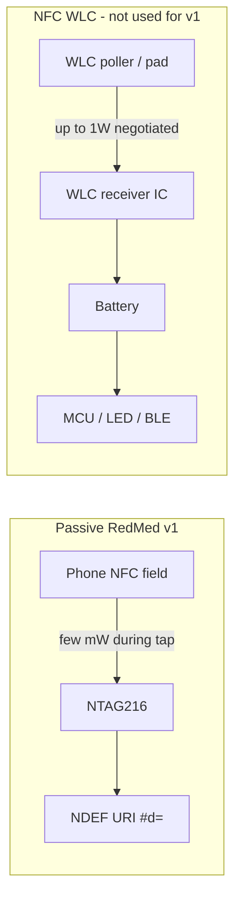

# Wireless charging guidance for RedMed

Research notes on whether RedMed needs wireless charging, and when (if ever) it applies.

## Verdict (passive NFC — current product)

**Wireless charging is not needed for RedMed's current bracelet.**

| Question | Answer |
|----------|--------|
| Does a passive NTAG216 need Qi / NFC WLC? | **No.** There is no battery to charge. |
| How does the chip get power today? | The phone's NFC field (13.56 MHz) briefly energizes the chip on tap — inherent ISO/IEC 14443 behavior, not a charging standard. |
| Can NTAG216 export harvested power? | **No.** It uses RF energy only to run itself. No VOUT / charger pin. |
| Should v1 packaging mention charging? | **No.** Say: "No battery. No charging required." |

That brief RF energize-on-tap is sometimes called energy harvesting in a loose sense, but it is **not** NFC Forum Wireless Charging (WLC) and **not** Qi. Confusing them in marketing would imply a battery that does not exist.

## Three different things people mix up

| Concept | What it is | Power scale | Needs battery? | RedMed v1 |
|---------|------------|-------------|----------------|-----------|
| **Passive NFC read** (ISO 14443) | Reader powers tag for data only | µW–few mW while field present | No | **Yes — this is the product** |
| **NFC energy harvesting** (e.g. ST25DV VOUT) | Dynamic tag rectifies RF to feed a tiny MCU/sensor **while field is present** | ~mW, not continuous | Optional / often none | No — wrong chip family |
| **NFC Wireless Charging (WLC 2.0)** | NFC Forum standard to **charge a battery** over NFC antenna | Up to **1 W** (classes 0.25–1 W) | **Yes** | Only if Path B powered band |
| **Qi / Qi2** | WPC inductive charging | 5–15+ W | **Yes** | Path B default for LED/SOS band |

Sources for standards context: [NFC Forum Wireless Charging](https://nfc-forum.org/learn/use-cases/wireless-charging/), WLC 2.0 (up to 1 W, small antennas for wearables/hearables).

## Path A (current launch): passive bracelet

Keep shipping blank NTAG216 bracelets per [docs/BRACELET.md](BRACELET.md).

- Responder UX: tap-to-browser, no app required.
- Customer copy: "No battery. No charging required."
- Do **not** add Qi coils, WLC receiver ICs, or charge UX to v1.

## Path B (future): powered bracelet

Wireless charging only applies if RedMed ships a **battery-powered** band (LED + SOS per BRACELET.md v2).

### Definition of done before prototyping

1. One powered feature that justifies a battery (LED display + SOS).
2. Dead-battery emergency access: passive NTAG216 fallback still readable by any phone.
3. Battery % on the **physical LED only** (local firmware).
4. Charging approach:
   - **Qi/Qi2** for the v2 display band (default in BRACELET.md).
   - **NFC WLC** only if a thinner form factor cannot fit a Qi coil (ROHM-class ~250 mW–1 W receivers exist for rings/bands).

### OEM RFQ checklist

- Dual-chip NFC: Qi/WLC RX + dedicated NTAG216 fallback.
- Charge current, charge time, thermals on wrist.
- Battery chemistry, UN38.3, FCC/CE.
- Antenna coexistence (Qi ~100 kHz vs NFC 13.56 MHz).
- QA: dead-battery tap still opens emergency card.

### Prototype validation checklist

- Passive tap works with depleted battery (LED may be blank).
- LED shows local battery % / charging on Qi pad.
- NFC range through silicone; soak/flex durability.
- Preserve "not a medical device" copy.

## Learning log (kept updated)

| Finding | Implication for RedMed |
|---------|------------------------|
| Passive NTAG216 has no battery terminals and no external harvest pin | Cannot "add wireless charging" to the current inlay |
| NFC WLC exists to charge **small batteries**, not to replace passive tags | Irrelevant until Path B |
| Ordinary tap already transfers enough energy to read/write NDEF | No charging step for v1 owners |
| Adding a battery without a clear powered feature only adds failure modes | Prefer Path A for launch |
| If Path B: keep passive NTAG for dead-battery emergency | Charging must never be required for responder access |

## Bottom line

- **Passive NFC medical ID → no wireless charging.**
- **Wireless charging → only for a future battery band (Path B), with passive NFC kept as fallback.**
