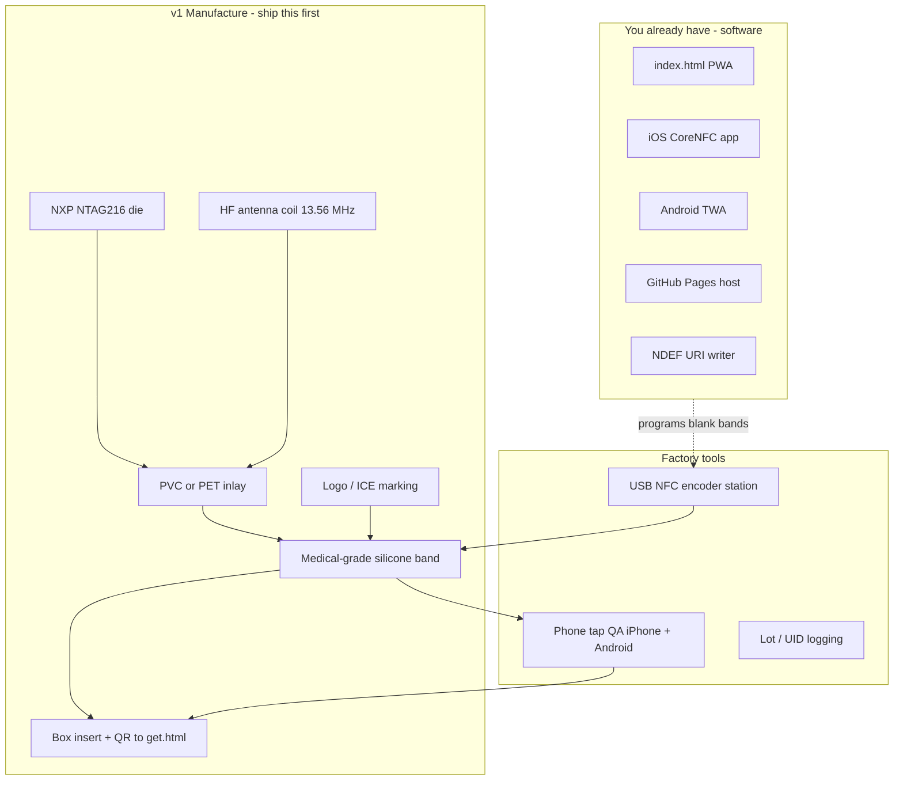
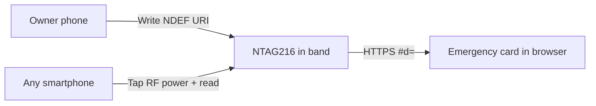
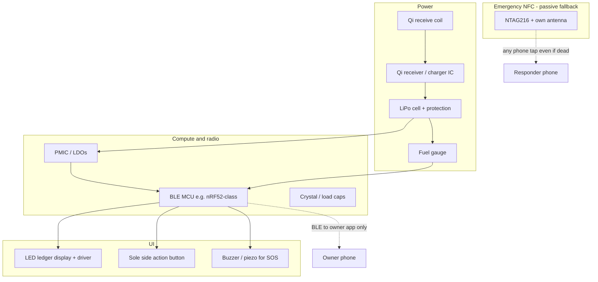
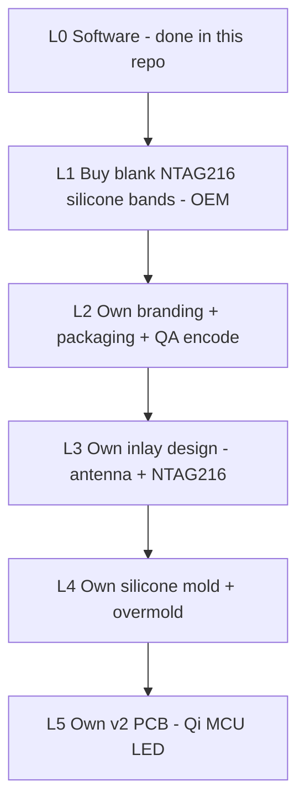

# Manufacturing BOM — vertical integration map

What you need to build RedMed hardware yourself (or with OEMs), given software already exists in this repo.

**Start with v1 (passive).** v2 (powered) is optional vertical expansion.

---

## v1 — Passive medical ID bracelet (minimum viable hardware)

No battery. No charging. Phone powers the chip on tap.

### Chips / electronics

| Item | Spec | Notes |
|------|------|-------|
| **NFC IC** | **NXP NTAG216** | 888 bytes user memory; ISO 14443 Type A; NDEF URI. NTAG215 OK for tiny profiles only. |
| **Antenna** | Etched/wound HF coil matched to 13.56 MHz | Full-size; outer face of band (away from pocket). Avoid micro tags that fail through silicone. |
| **Inlay substrate** | PVC / PET / PI flexible inlay | Chip + antenna laminated before overmold. |

**Not required for v1:** MCU, BLE, battery, Qi coil, WLC IC, display, buttons, crystal, regulators.

### Mechanics / materials

| Item | Spec |
|------|------|
| Band body | Medical-grade / hypoallergenic silicone (S/M/L or 38/40/41 mm sizes) |
| Optional plate | Metal / medical ID plate with embedded inlay |
| Markings | Deboss / print: ICE, tap cue, lot code |
| Durability | Target IP67 if marketed wet/outdoor |

### Encoding & fulfillment

| Item | Role |
|------|------|
| Blank NTAG216 bands | Preferred v1 — owner writes via RedMed |
| USB NFC writer (ACR122U-class or industrial) | Optional pre-encode at warehouse |
| QA phones | iPhone + Android; locked + unlocked tap test |
| Packaging | Insert per [PACKAGING.md](../PACKAGING.md); QR → `get.html` |

### Software you already own (no new chips)

| Surface | Programs / reads |
|---------|------------------|
| [`index.html`](../index.html) | Profile → `#d=` URL; Web NFC write on Chrome Android |
| iOS app | CoreNFC write/read + verify |
| Hosted Pages | Emergency card any phone can open |

---

## v2 — Powered band (only if you vertical-integrate further)

Adds LED + SOS side button + Qi charge. **Keep a separate NTAG216** so dead battery still opens the emergency card.

### Extra chips / parts (v2 only)

| Block | Examples of what to source | Why |
|-------|----------------------------|-----|
| Qi RX | Qi/Qi2 receiver + matching coil + ferrite | Charge without ports |
| Battery | Small LiPo + PCM/protection | Powers LED/SOS/BLE |
| Fuel gauge | Battery monitor IC or MCU ADC | LED `BAT xx%` |
| MCU + BLE | Nordic nRF52-class or similar | SOS, PIN, display, bond token |
| Display | Low-power LED matrix / ledger module + driver | Local battery + countdown |
| Button | Flush side switch (sole control) | SOS arm / cancel |
| Audio | Piezo / magnetic transducer | Loud SOS siren on-band |
| Passives | Ferrite, caps, ESD, antenna matching | Coexistence Qi vs NFC |
| **NTAG216 inlay** | Same as v1 | **Non-negotiable** emergency path |

Optional alternate charge: NFC WLC receiver (ROHM-class) instead of Qi if the band must stay ring-thin — see [WIRELESS_CHARGING.md](../WIRELESS_CHARGING.md).

---

## Vertical integration ladder

What to own in-house vs buy:

| Level | You own | Buy / partner |
|-------|---------|----------------|
| **L0** | App, web, Pages URL | — |
| **L1** (recommended start) | Spec + QA | Finished blank NTAG216 bands |
| **L2** | Brand, insert, fulfillment SOP | Same bands + box printer |
| **L3** | Antenna geometry, inlay gerbers | Chip + flex fab |
| **L4** | Mold tooling, silicone compound | Overmold factory |
| **L5** | v2 schematics, firmware | PCB fab, battery cells, cert lab |

---

## Factory line (v1)

1. Receive / inspect NTAG216 inlays (reject UID-only).
2. Overmold into silicone (or mount plate).
3. Optional: encode NDEF at station (or ship blank).
4. QA matrix in [BRACELET.md](../BRACELET.md) — iPhone + Android tap.
5. Pack with disclaimers; lot mark for support.

---

## Related

- Hardware rules: [BRACELET.md](../BRACELET.md)
- Charging research: [WIRELESS_CHARGING.md](../WIRELESS_CHARGING.md)
- Packaging copy: [PACKAGING.md](../PACKAGING.md)
- Fulfillment: [FULFILLMENT.md](../FULFILLMENT.md)
- Agent catalog: [AGENT_PROMPTS.md](../AGENT_PROMPTS.md) §4
- Plan note: [wireless-charging.md](wireless-charging.md)
