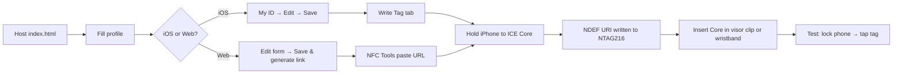
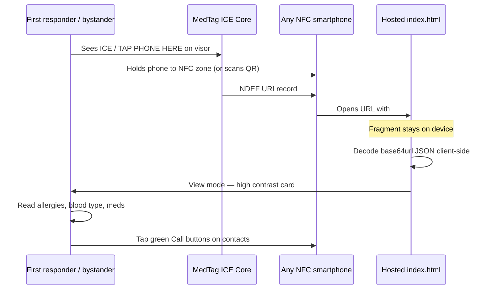

# MedTag Road ICE — Physical Device Design

**Product name:** **MedTag Road ICE Visor Clip** (primary SKU)  
**Tag family:** **MedTag ICE Core** — one reusable NFC card, multiple carry options  
**Pairs with:** RedMed PWA (`index.html`) + iOS companion (`WriteTagView` / `NFCWriter`)

---

## Executive summary

The best single product for this app’s **roadside + medical ID** mission is a **vehicle sun-visor clip** holding a **removable ISO credit-card ICE Core** with an embedded **NTAG216** passive NFC inlay. First responders already search the vehicle cabin during traffic incidents; a high-contrast **ICE** marker at eye level on the visor is faster to find than a phone buried in a bag, and NFC tap geometry is ideal on a flat, rigid surface.

A tight secondary SKU — **MedTag ICE Wristband** (same ICE Core in a silicone sleeve) — covers crashes where the driver is away from the vehicle. Both use identical encoding, setup, and responder flows.

**Why not wristband-only?** Curved wrists weaken NFC coupling, sizing excludes some users, and unconscious victims may not expose a wrist. **Why not dash sticker-only?** Stickers are hard to rewrite, easy to peel, and offer no QR backup surface. **Why not helmet-only?** Too narrow for cyclists/motorcyclists only.

---

## User personas and use cases

| Persona | Scenario | Why this device |
|--------|----------|-----------------|
| **Daily commuter** | Single-car fender bender; bystander needs blood type and allergies | Visor clip visible from driver door; tap opens card in 2 seconds |
| **Parent / caregiver** | Child’s epinephrine or allergy info must be found fast | ICE Core in family minivan visor; profile lists allergies in red-highlight section |
| **Motorcyclist / rideshare driver** | Wears wristband SKU; vehicle has visor clip backup | Same profile written once to Core; swap between clip and band |
| **Older adult with polypharmacy** | Medication list too long for metal bracelet engraving | NTAG216 holds full med list; update via iPhone rewrite, no re-engraving |
| **First responder / bystander** | Unresponsive driver, locked phone | Tap tag → browser opens high-contrast card; tap-to-call emergency contacts |

---

## Product architecture

### Primary: MedTag Road ICE Visor Clip

```
┌─────────────────────────────────────────┐
│  VISOR CLIP (ABS, slate #0f172a)        │
│  ┌───────────────────────────────────┐  │
│  │  REFLECTIVE STRIP (3M retro)      │  │
│  ├───────────────────────────────────┤  │
│  │  ICE CORE CARD (removable)        │  │
│  │  ┌─────┐  REDMED              │  │
│  │  │ NFC │  TAP PHONE HERE          │  │
│  │  │logo │  ─────────────────       │  │
│  │  └─────┘  [red accent bar]        │  │
│  │         NTAG216 inlay center      │  │
│  └───────────────────────────────────┘  │
│  spring steel visor clamp               │
└─────────────────────────────────────────┘
         │
         │  (back of ICE Core)
         ▼
┌─────────────────────────────────────────┐
│  QR CODE (same URL as NFC)              │
│  Quick ref (6 pt, no emoji):            │
│  1. Call 911                              │
│  2. Tap phone to front / scan QR          │
│  3. Check allergies & blood type          │
└─────────────────────────────────────────┘
```

### Secondary SKU: MedTag ICE Wristband

- Silicone band (S/M/L), slate outer / red inner stripe
- **ICE Core** slides into a sealed TPU window pocket (same card as visor kit)
- Reflective **ICE** deboss on band exterior
- Optional breakaway clasp for snagging safety

---

## Dimensions and materials

| Component | Spec |
|-----------|------|
| **ICE Core card** | ISO 7810 ID-1: **85.6 × 54.0 × 0.84 mm** (CR-80 + inlay) |
| **NFC antenna zone** | **Ø 30 mm** clear tap target, centered on card face |
| **Visor clip body** | **92 × 58 × 14 mm**; spring clip opens to **25 mm** visor thickness |
| **Wristband pocket** | Accepts same ICE Core; band width **22 mm** |
| **Card substrate** | Polycarbonate or PETG laminate, **4-layer**: face print → NTAG inlay → adhesive → back print |
| **Clip housing** | ABS or glass-filled nylon, **slate (#0f172a)** matte; **red (#dc2626)** accent stripe matching app UI |
| **Reflective element** | 3M Scotchlite or equivalent, **25 × 54 mm** strip on clip lip (night roadside visibility) |
| **Coating** | Matte UV-resistant overlay; **IP54** equivalent for visor (cab interior); wristband SKU **IP67** band only |
| **Operating temp** | −20 °C to +70 °C (NTAG216 spec); no battery |

### Industrial design notes

- **Visual language** mirrors the app: slate/white surfaces, **#dc2626** red for ICE/REDMED header and critical accents (same as `--accent` in `index.html` and `AppTheme.accent` in iOS).
- **Typography:** bold sans-serif (Helvetica/Arial family), all caps for **ICE** and **TAP PHONE HERE** — readable at arm’s length in stress.
- **No emoji** on printed surfaces (per product requirement); use ISO-style NFC wave icon and a simple red cross mark consistent with `assets/icon.svg`.
- **Raised tactile ring** around NFC zone so a gloved hand can locate the tap spot by feel.
- Clip designed so card **slides out** for rewriting without removing clip from visor (card eject notch).

---

## NFC chip specification

| Parameter | Choice | Rationale |
|-----------|--------|-----------|
| **IC** | **NXP NTAG216** (ISO/IEC 14443 Type A, NFC Forum Type 2) | App warns above ~850 encoded chars; 216 gives **888 bytes** user memory — headroom for full profiles |
| **Fallback** | NTAG215 if user keeps entries minimal (<480 chars) | Cost savings for budget DIY kits |
| **Avoid** | NTAG213 for shipped product | Only ~137 bytes — most real profiles exceed 140 characters |
| **Memory layout** | Single **NDEF message**, one **URI record** (Well-Known Type) | Matches `NFCWriter.swift` (`NFCNDEFPayload.wellKnownTypeURIPayload`) |
| **Locking** | **Do not** lock tag at factory; user rewrites via app | Profile updates require rewrite (`SETUP.md`) |
| **Read range** | ~1–4 cm through card laminate | Works with iPhone/Android locked-screen tag read |

### Capacity thresholds (from app)

These match `ProfileLinkBuilder.capacityNote` and `index.html`:

| Encoded payload (base64url chars) | Minimum tag |
|-----------------------------------|-------------|
| ≤ 140 | NTAG213+ |
| 141 – 480 | NTAG215 or NTAG216 |
| 481 – 850 | NTAG216 |
| > 850 | Shorten profile or split strategy (not supported today) |

**Manufacturing default:** ship **NTAG216** in every ICE Core so buyers never hit capacity errors.

---

## What gets encoded

The tag stores **one URL** — no separate app install, no proprietary payload:

```
https://<your-hosted-domain>/index.html#d=<base64url(JSON)>
```

**JSON fields** (shared web + iOS schema):

`name`, `dob`, `blood`, `donor`, `allergies[]`, `meds[]`, `conditions[]`, `contacts[]` (`name`, `rel`, `phone`), `doc`, `insurance`, `notes`, `updated`

- Data lives in the **URL fragment** (`#d=…`). Browsers do not send fragments to servers — consistent with local-only privacy model.
- Encoding: JSON → base64url (no `+`, `/`, `=` padding), same as `ProfileLinkBuilder.buildURL`.
- **QR backup** on card back encodes the **identical full URL** (including `#d=`) for cameras/scanners that handle URI fragments.

---

## Setup flow (user → tag → mount)



### Step-by-step (recommended: iOS app)

1. **Host** `index.html` at a stable HTTPS URL (GitHub Pages, Netlify, etc.).
2. Set `AppConfig.medicalCardBaseURL` to that URL (no trailing slash or hash).
3. **My ID** → enter allergies, meds, blood type, emergency contacts → **Save**.
4. Review capacity note on **Write Tag** tab (should show NTAG216 compatibility).
5. Tap **Write tag** → hold iPhone over the **center** of the ICE Core (~1 second).
6. On success, insert Core into visor clip (or wristband sleeve).
7. **Mount** visor clip on passenger-side sun visor (recommended: visible when visor is down or rotated toward windshield).
8. **Test** with a second phone: locked screen → tap → emergency card opens in view mode.

### Updates

Edit profile → **Write tag** again on the **same** physical tag (tags are rewritable). No server account. Old URL in bookmarks becomes stale; only the tag/QR matters.

---

## Responder flow (tap → emergency card)



### What the responder sees

The hosted page opens directly in **view mode** (read-only emergency card):

- Header: **REDMED** tag, patient **name**, age/DOB, **blood type**
- **Critical section** (red-tinted background): **allergies**
- Medications, conditions, organ donor flag if set
- **Emergency contacts** with one-tap **Call** links (`tel:`)
- Doctor and insurance if provided
- Free-text notes (e.g. “Pacemaker left chest”, “Autism — may not respond to verbal commands”)
- Last updated timestamp

No login, no app install, works offline **after first page load** if the PWA was cached; first open needs network to fetch `index.html` unless previously visited. For maximum offline resilience, host on a fast CDN and encourage a one-time “open and bookmark” by the owner.

**Printed quick reference** on card back (always available without network):

```
IN EMERGENCY
1. CALL 911
2. TAP PHONE TO FRONT (NFC) OR SCAN QR
3. CHECK ALLERGIES AND BLOOD TYPE
```

---

## Roadside durability checklist

| Requirement | Design response |
|-------------|-----------------|
| No battery for ID | Passive NTAG216 only |
| Visible in chaos | ICE + red accent + reflective strip on clip |
| Weather | Visor-mounted = interior protected; wristband SKU sealed TPU |
| Rewrite without trashing hardware | Removable ICE Core; clip stays mounted |
| Glove-friendly | 30 mm tap zone, tactile ring |
| Night / low light | Retroreflective strip on clip lip |
| Phone compatibility | Standard NDEF URI — iOS 11+, Android NFC |

---

## Bill of materials — rough cost tiers

Estimates USD, per **one ICE Core + visor clip** kit, excluding packaging and fulfillment.

| Tier | What's included | Est. COGS | Suggested retail |
|------|-----------------|-----------|------------------|
| **DIY maker** | NTAG216 sticker + laminated print-at-home card + 3D-printed clip | **$2 – $5** | N/A |
| **Small batch (100–500)** | Custom PVC inlay card, injection clip, sleeve packaging | **$6 – $10** | **$24 – $29** |
| **Mass production (10k+)** | Automated inlay lamination, molded clip, QR print | **$3.50 – $5.50** | **$17 – $22** |

**Line-item reference (mass tier):**

| Item | Unit cost |
|------|-----------|
| NTAG216 wet inlay | $0.35 – $0.55 |
| PVC lamination + print (4/4) | $0.40 – $0.70 |
| ABS visor clip (molded) | $0.80 – $1.20 |
| Reflective strip | $0.15 – $0.25 |
| Wristband SKU add-on (band + TPU window) | +$1.50 – $2.50 |

**Optional premium:** pre-paired “blank Core + app deep link” insert — still user-writable, no PII at factory.

---

## System diagram (device + app)

```
┌──────────────────────────────────────────────────────────────────┐
│                        USER'S PHONE                              │
│  ┌─────────────┐    ┌──────────────┐    ┌───────────────────┐  │
│  │ My ID       │───▶│ ProfileStore │───▶│ ProfileLinkBuilder│  │
│  │ (edit/save) │    │ (local only) │    │ base64url #d= URL │  │
│  └─────────────┘    └──────────────┘    └─────────┬─────────┘  │
│                                                    │             │
│  ┌─────────────┐    ┌──────────────┐              │             │
│  │ Write Tag   │───▶│ NFCWriter    │──write NDEF─┘             │
│  └─────────────┘    └──────────────┘                            │
└────────────────────────────│─────────────────────────────────────┘
                             │ NFC write (setup only)
                             ▼
              ┌──────────────────────────────┐
              │   MedTag ICE Core (NTAG216)  │
              │   Visor clip / wristband     │
              └──────────────┬───────────────┘
                             │ NFC read (any phone, any time)
                             ▼
              ┌──────────────────────────────┐
              │  Browser → index.html#d=…    │
              │  View mode emergency card    │
              └──────────────────────────────┘
```

---

## Manufacturing and QA notes

1. **Inlay placement:** center NTAG216 coil in 30 mm tap zone; keep 2 mm minimum from card edge for lamination peel strength.
2. **Acceptance test:** write known test URI, verify with NFC Tools read-back; spot-check read on iPhone + one Android.
3. **Print proof:** red (#dc2626) and slate (#0f172a) against Pantone swatches; reflective strip visibility at 50 m with headlamps (informal).
4. **No factory pre-write of user PII** — ship blank; Quick Start card shows QR to hosted demo + link to app.
5. **Regulatory:** passive NFC only — no FCC radio certification beyond standard NTAG module compliance; avoid medical device claims (information carrier, not a diagnostic device).

---

## Mockup

See [`assets/medtag-road-ice-mockup.svg`](assets/medtag-road-ice-mockup.svg) for a front-face industrial design sketch (slate/red, NFC tap zone, reflective strip, visor clip silhouette).

---

## Future variants (out of scope for v1)

- **Fleet bulk write** — MDM-style CSV → multiple tags (would need desktop NFC writer tool)
- **Dual-profile Core** — not supported by current single-URI write path
- **Encrypted payload** — conflicts with instant first-responder access model in README

---

## Related project files

| File | Relevance |
|------|-----------|
| `README.md` | Hosting, tag writing, privacy model |
| `index.html` | URL encoding, capacity warnings, view mode UI |
| `ios/SETUP.md` | iOS NFC entitlement, NTAG215/216 guidance |
| `ios/RedMed/Services/NFCWriter.swift` | NDEF URI write implementation |
| `ios/RedMed/Services/ProfileLinkBuilder.swift` | `#d=` URL builder + capacity tiers |
| `ios/RedMed/Views/WriteTagView.swift` | User-facing write flow |
